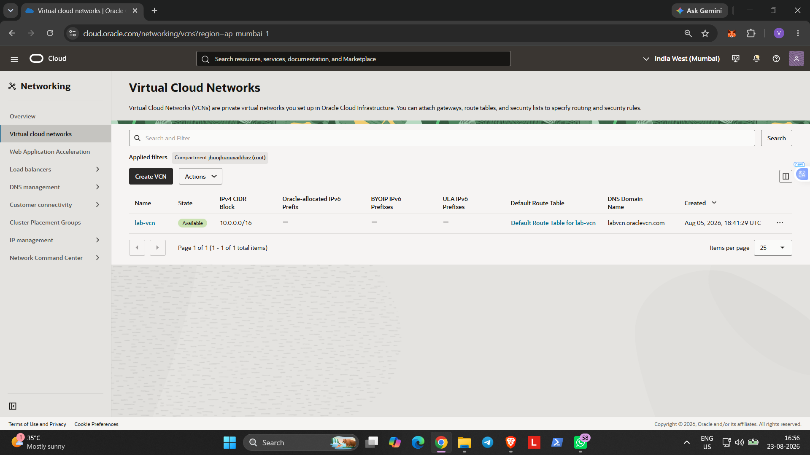
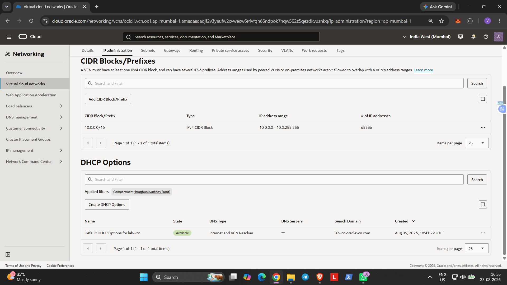
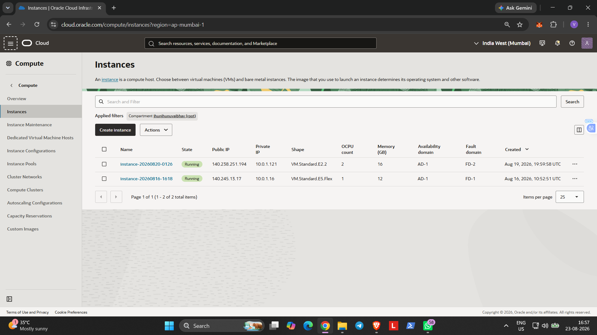
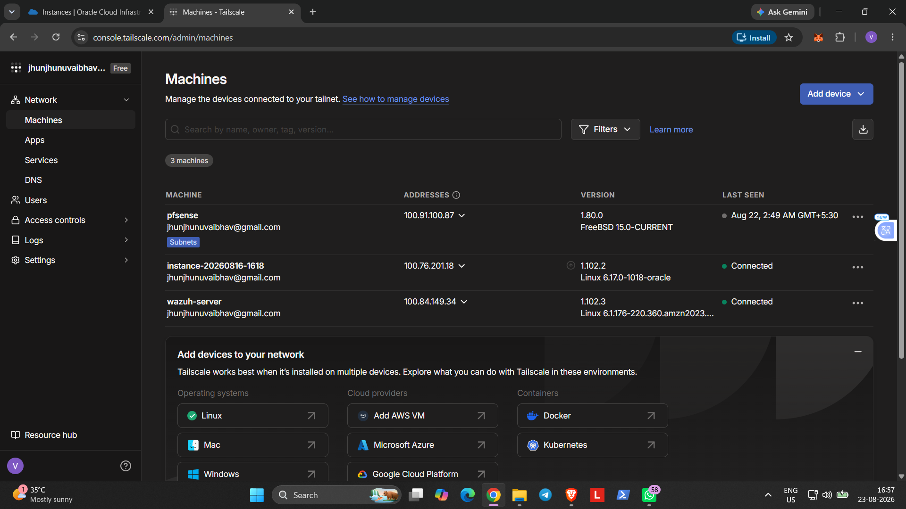

# Hybrid Home SOC Lab — Architecture

## Overview

This document describes the **local-first** architecture of the lab. The repository also preserves the earlier OCI/Tailscale deployment as historical project evidence.

### Current local environment

- Windows physical host
- VMware Workstation Pro
- pfSense firewall and router
- Guest VLAN segmentation
- Suricata IDS/IPS
- pfBlockerNG
- Kali Linux attacker VM
- Ubuntu Desktop defender/test VM
- DVWA and OWASP Juice Shop test targets
- n8n automation environment
- Standalone ELK stack — current build: Elasticsearch, Logstash and Kibana

### Historical environment

The earlier phase used Oracle Cloud Infrastructure, Tailscale, an OCI Ubuntu instance, Kali through Docker, and a Wazuh server. Those components are **not part of the active architecture now**.

---

## Current Local Architecture

```text
                         INTERNET
                             |
                             v
                    +-------------------+
                    |     pfSense       |
                    | Firewall / Router |
                    | VLAN Segmentation |
                    | Suricata /        |
                    | pfBlockerNG       |
                    +---------+---------+
                              |
                    +---------+---------+
                    |                   |
                    v                   v
             +-------------+     +-------------+
             | Kali Linux  |     | Ubuntu      |
             | Attacker    |     | Defender /  |
             |             |     | Test Host   |
             +-------------+     +------+------+
                                        |
                              +---------+---------+
                              | DVWA / Juice Shop |
                              | Controlled Targets|
                              +---------+---------+
                                        |
                                  Logs / Events
                                        |
                                        v
                              +-------------------+
                              |     Logstash      |
                              | Ingest / Parse    |
                              +---------+---------+
                                        |
                                        v
                              +-------------------+
                              |  Elasticsearch    |
                              |  Store / Search   |
                              +---------+---------+
                                        |
                                        v
                              +-------------------+
                              |      Kibana       |
                              | Hunt / Visualize  |
                              +---------+---------+
                                        |
                                        v
                              +-------------------+
                              |      n8n          |
                              | Automation / SOC  |
                              +-------------------+
```

## Architecture Components

### Windows Physical Host

The Windows laptop is the physical host for the local lab. VMware Workstation Pro runs the virtual security environment on this machine.

### VMware Workstation Pro

VMware provides the virtualization layer for the local environment. The main security VMs include pfSense, Kali Linux, Ubuntu Desktop, and the supporting automation/SIEM workloads as hardware resources allow.

### pfSense Security Layer

pfSense is the network security gateway for the lab. It provides routing, firewall policy, VLAN segmentation, and network telemetry.

Security services documented in the lab include:

- Suricata IDS/IPS
- pfBlockerNG
- Firewall rules
- Guest VLAN
- Syslog forwarding

### Kali Linux

Kali is the controlled attacker/test side of the environment. It is used to generate reconnaissance, authentication, network, and web-security activity against deliberately vulnerable lab targets.

### Ubuntu Desktop / Test Environment

Ubuntu provides the defender/test side of the lab. DVWA and OWASP Juice Shop are used as controlled web-security targets for attack and detection exercises.

### ELK — Current Build

The current SIEM/logging direction is a standalone local ELK stack:

```text
pfSense / Linux / Windows / Kali / Applications
                         |
                         v
                    Logstash
                         |
                         v
                  Elasticsearch
                         |
                         v
                      Kibana
```

The build is intentionally modular so additional telemetry sources can be added without changing the overall SOC workflow.

### n8n Automation

n8n is used for workflow automation. The earlier Wazuh phase validated a Wazuh → Integrator → n8n Webhook → Telegram notification workflow. Future automation can be rebuilt around ELK alerts and investigation data.

---

## Evidence — VMware / Local Lab

The following screenshots are stored in this directory and are rendered directly by GitHub when viewing this README:


---

## Historical Cloud Architecture

The following architecture was previously validated and is retained for documentation/history only:

```text
Local VMware Lab
      |
   pfSense
      |
  Tailscale
      |
   OCI VCN
    /    \
Ubuntu   Wazuh
 CLI     Server
  |
Kali/Docker
```

Historical evidence:









> **Status:** Oracle Cloud, Tailscale cloud connectivity, and the OCI Wazuh deployment are historical phases of the project and should not be interpreted as currently running infrastructure.

---

## Security Flow

The lab is built around one repeatable loop:

```text
Attack Activity
      |
      v
Network / Host Telemetry
      |
      v
Logstash Ingestion
      |
      v
Elasticsearch
      |
      v
Kibana Detection / Hunting
      |
      v
SOC Investigation
      |
      v
n8n Automation
      |
      v
Response / Documentation
```

This structure lets the project demonstrate networking, Linux/Windows telemetry, SIEM concepts, detection engineering, investigation, and automation in one environment.
