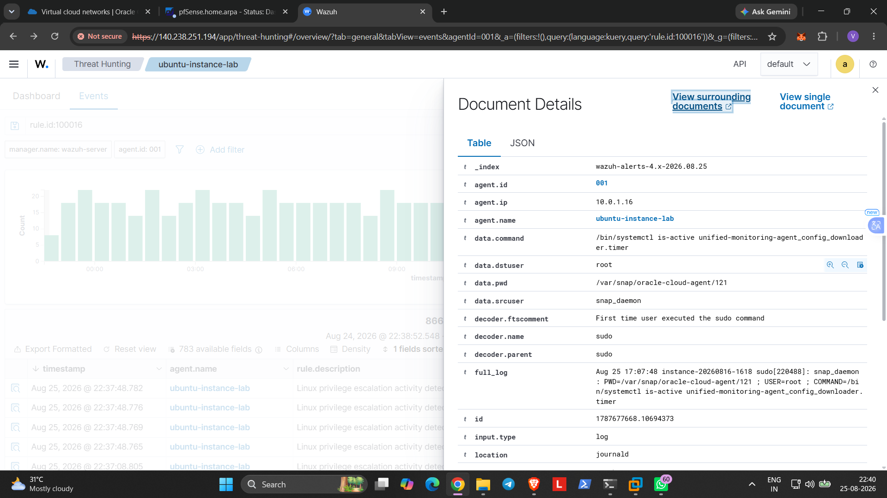
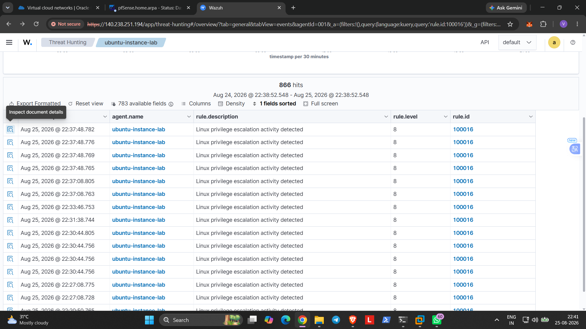
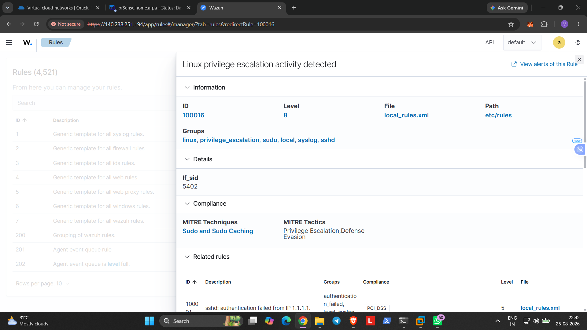
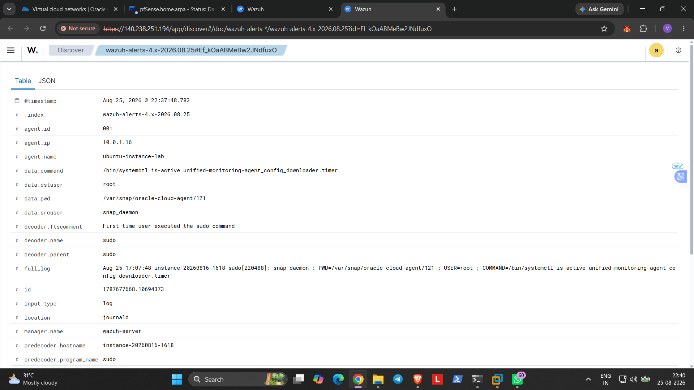
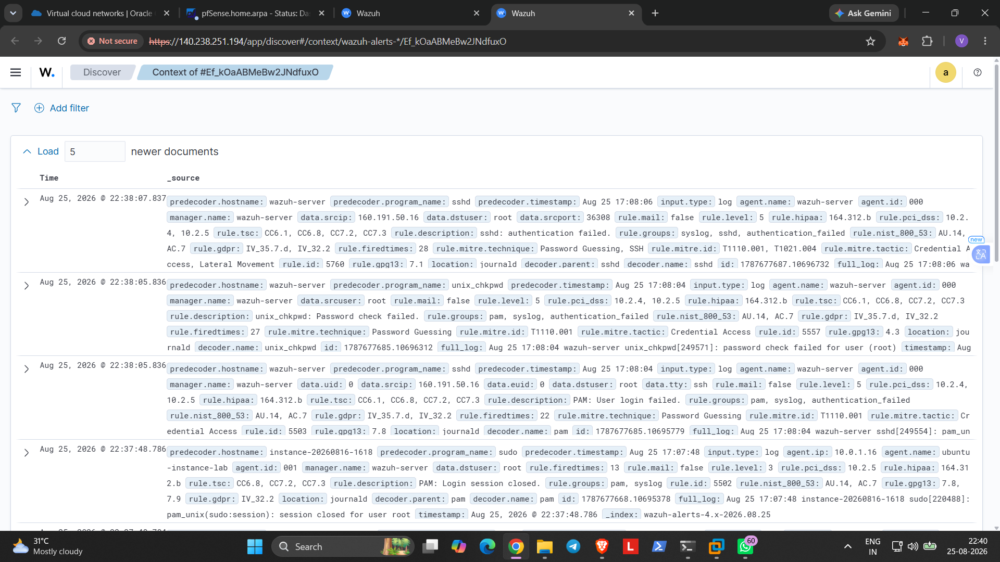
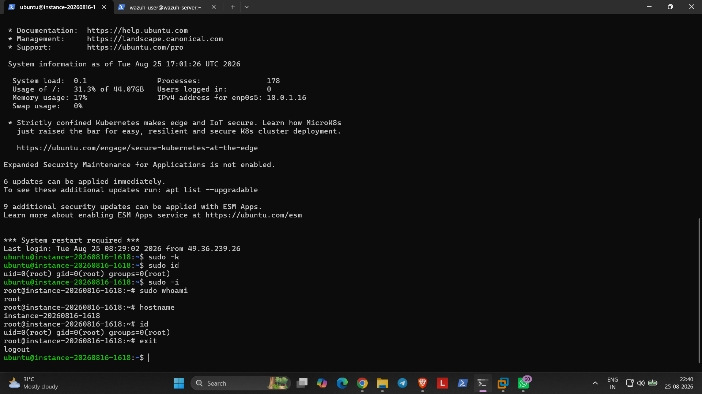

# Linux Sudo Privilege Escalation Detection

## 1. Overview

This investigation demonstrates the detection and analysis of Linux privilege escalation activity involving the `sudo` command.

The activity was generated on the Ubuntu endpoint `ubuntu-instance-lab` and detected by Wazuh using Linux system logs and a custom detection rule.

The investigation validates the complete detection path from sudo execution on the Linux endpoint to the resulting Wazuh security alert.

---

## 2. Detection Summary

| Field | Value | Description |
|---|---|---|
| Endpoint | ubuntu-instance-lab | Linux monitored endpoint |
| Telemetry | Linux system logs / journald | Linux authentication and sudo telemetry |
| Detection | Rule 100016 | Custom Wazuh detection |
| Parent Rule | 5402 | Wazuh sudo activity rule |
| Alert Level | 8 | Medium-high severity |
| MITRE ATT&CK | T1548.003 | Sudo and Sudo Caching |

---

## 3. Detection Logic

The detection uses Wazuh rule `100016` to identify sudo activity on the Linux endpoint.

The custom rule is configured as a child rule of Wazuh rule `5402`, which identifies sudo-related events.

The custom rule increases visibility by generating a dedicated alert for Linux privilege escalation activity.

```xml
<rule id="100016" level="8">
    <if_sid>5402</if_sid>
    <description>Linux privilege escalation activity detected</description>
    <group>linux,privilege_escalation,sudo,</group>
    <mitre>
        <id>T1548.003</id>
    </mitre>
</rule>
```

---

## 4. Activity Simulation

The detection was validated by performing controlled sudo activity on the Ubuntu endpoint.

The following commands were executed during testing:

```bash
sudo -k
sudo id
sudo -i
sudo whoami
hostname
id
exit
```

The commands were executed as part of a controlled SOC detection-validation exercise.

The sudo activity generated Linux system telemetry that was collected by the Wazuh agent and forwarded to the Wazuh manager.

---

## 5. Detection Validation

The generated Linux sudo events were successfully received by the Wazuh agent and processed by the Wazuh manager.

The resulting detection was identified as:

- **Custom Rule:** 100016
- **Alert Level:** 8
- **Parent Rule:** 5402
- **Description:** Linux privilege escalation activity detected
- **MITRE ATT&CK:** T1548.003 — Sudo and Sudo Caching
- **Endpoint:** ubuntu-instance-lab

The alert was visible in Wazuh Threat Hunting and Discover.

---

## 6. Investigation Evidence

The Wazuh alert provided process and authentication-related telemetry associated with the sudo activity.

The investigated event contained fields including:

- Agent name
- Agent IP address
- Executed command
- Executing user
- Working directory
- Decoder
- Full log
- Rule ID
- Rule level
- MITRE ATT&CK mapping
- Timestamp

The underlying event was decoded using the Wazuh `sudo` decoder and contained the sudo command executed on the Linux endpoint.

---

## 7. Investigation Findings

The investigation confirmed that sudo activity occurred on the monitored Ubuntu endpoint.

Key findings:

- The Linux endpoint generated sudo-related telemetry.
- Wazuh successfully received and decoded the event.
- Parent rule `5402` identified the sudo activity.
- Custom rule `100016` generated the dedicated detection.
- The alert was assigned Level 8 severity.
- The activity was mapped to MITRE ATT&CK `T1548.003`.
- Wazuh Discover provided additional event context for investigation.

The activity was intentionally generated as part of a controlled detection-validation exercise.

---

## 8. Wazuh Alert Analysis

The resulting Wazuh event contained the following important fields:

| Field | Observed Value |
|---|---|
| Agent | ubuntu-instance-lab |
| Decoder | sudo |
| Rule ID | 100016 |
| Rule Level | 8 |
| Rule Description | Linux privilege escalation activity detected |
| Rule Groups | local, syslog, sshd, linux, privilege_escalation, sudo |
| MITRE Technique | T1548.003 |
| MITRE Tactic | Privilege Escalation, Defense Evasion |
| Location | journald |

The event demonstrated that Wazuh successfully correlated the underlying sudo telemetry with the custom detection rule.

---

## 9. SOC Detection Workflow

The investigation followed this workflow:

1. Controlled sudo activity was executed on the Ubuntu endpoint.
2. Linux generated sudo-related system telemetry.
3. The Wazuh agent collected the event.
4. The event was forwarded to the Wazuh manager.
5. Wazuh decoder `sudo` processed the event.
6. Parent rule `5402` identified sudo activity.
7. Custom rule `100016` matched the event.
8. Wazuh generated a Level 8 security alert.
9. The alert was investigated using Wazuh Threat Hunting and Discover.
10. Event metadata and the underlying log were reviewed to validate the detection.

---

## 10. MITRE ATT&CK Mapping

| Technique | ID | Description |
|---|---|---|
| Sudo and Sudo Caching | T1548.003 | Abuse of sudo can allow a user or process to execute commands with elevated privileges when permitted by the system configuration. |

---

## 11. Detection Engineering Notes

The custom rule was intentionally designed as a child rule of Wazuh rule `5402`.

This approach allows the detection to reuse Wazuh's existing sudo event recognition while providing a dedicated alert for the SOC investigation.

The rule does not treat every sudo execution as inherently malicious.

Instead, the alert provides visibility into sudo activity that can be investigated using additional context such as:

- Executed command
- User account
- Source information
- Authentication context
- Parent process or service
- Timestamp
- System configuration
- Other activity surrounding the event

This contextual approach is important because legitimate administrators may also use sudo.

---

## 12. Investigation Outcome

**Detection:** Successful  
**Telemetry:** Linux sudo / journald events  
**Parent Rule:** 5402  
**Custom Rule:** 100016  
**Alert Level:** 8  
**MITRE ATT&CK:** T1548.003  
**Endpoint:** ubuntu-instance-lab

The detection successfully identified controlled sudo activity and generated the expected Wazuh alert.

---

## 13. Lessons Learned

- Linux sudo activity can provide valuable privilege-related telemetry.
- Wazuh can decode Linux sudo events and correlate them with detection rules.
- Child rules can create focused SOC detections from existing Wazuh rules.
- MITRE ATT&CK mappings provide useful context for detected behavior.
- A sudo alert should be investigated using surrounding context rather than automatically treated as malicious.
- Wazuh Discover provides useful event-level information for validating and investigating detections.

---

## 14. Final Status

**Status: Detection Successfully Implemented and Validated**

The Linux sudo activity was successfully detected by Wazuh using custom rule `100016`.

The investigation confirmed the complete detection path from controlled Linux sudo activity through journald, the Wazuh agent, the Wazuh manager, and finally the custom SOC alert.

This investigation demonstrates the use of Linux authentication telemetry, Wazuh custom rules, event investigation, and MITRE ATT&CK mapping as part of an end-to-end SOC detection workflow.

---

## 15. Evidence Screenshots

### 15.1 Sudo Activity



### 15.2 Wazuh Detection



### 15.3 Wazuh Rule Details



### 15.4 Wazuh Alert Details



### 15.5 Wazuh Event Context


### 15.6 Wazuh Alert JSON



### 15.7 Linux Command Execution



---

## 16. Investigation Summary

| Category | Result |
|---|---|
| Endpoint | Ubuntu Linux |
| Activity | Sudo execution |
| Data Source | journald / Linux system logs |
| Decoder | sudo |
| Parent Rule | 5402 |
| Custom Rule | 100016 |
| Severity | Level 8 |
| MITRE ATT&CK | T1548.003 |
| Detection Status | Successful |
| Investigation Status | Validated |

---

## 17. Final Investigation Statement

This investigation demonstrates an end-to-end Linux privilege escalation detection workflow using Wazuh.

Controlled sudo activity was generated on the Ubuntu endpoint and captured through Linux system telemetry. The Wazuh agent forwarded the event to the Wazuh manager, where the sudo decoder and parent rule `5402` processed the activity.

Custom rule `100016` generated a dedicated Level 8 alert and mapped the activity to MITRE ATT&CK technique `T1548.003`.

The investigation was successfully validated using Wazuh alert data, event context, command execution evidence, and the underlying Linux telemetry.

**Final Status: Detection Successfully Implemented and Validated**
