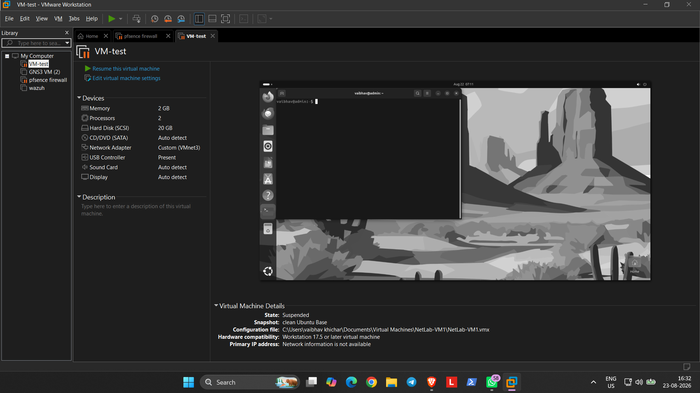
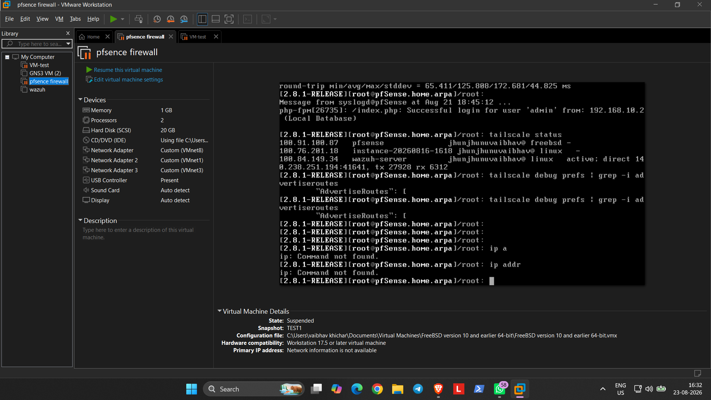
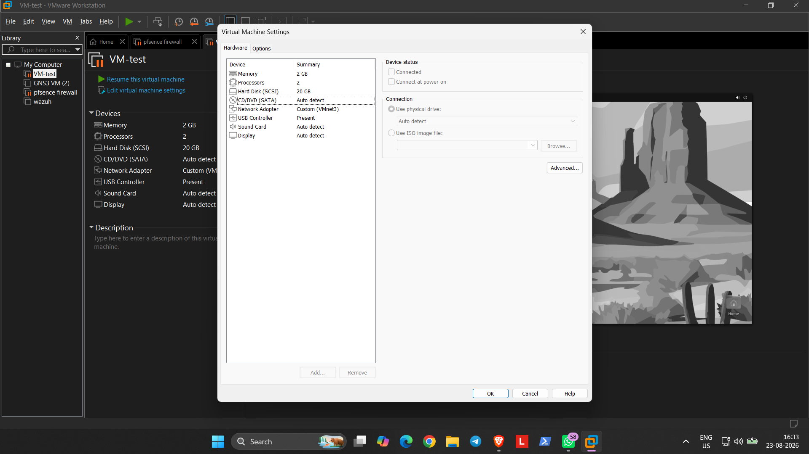
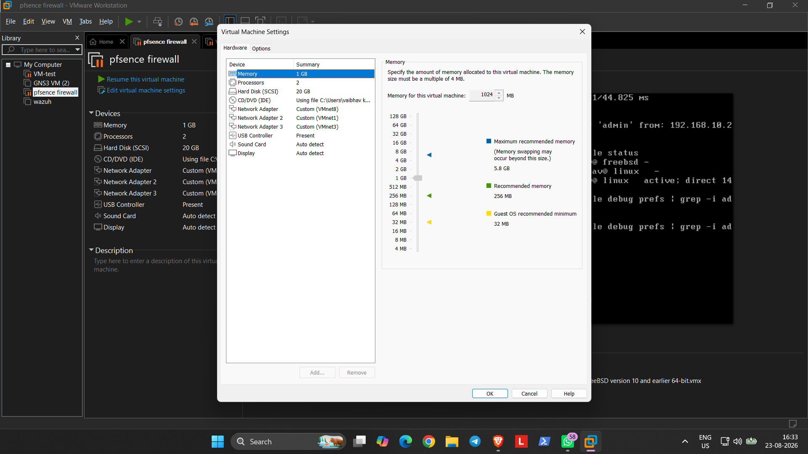

# Hybrid Home SOC Lab

> **Build. Attack. Detect.** — a hands-on home Security Operations Center lab for networking, detection engineering, investigation, and security automation.

This repository documents the evolution of my SOC lab from a local VMware environment, through a validated Wazuh + Oracle Cloud phase, and now back to a **local-first ELK build**.

The goal is not to collect tools. The goal is to build a repeatable security workflow:

**Generate activity → collect telemetry → detect → investigate → automate → document**

---

## Current Lab Direction

The active environment is intentionally local and does **not** depend on Oracle Cloud.

```text
                         LOCAL SOC LAB

                         Kali Linux
                        ATTACK / TEST
                              |
                              v
                    +-------------------+
                    |      pfSense      |
                    | Firewall + VLANs  |
                    | Suricata /        |
                    | pfBlockerNG       |
                    +---------+---------+
                              |
                              v
                 +-------------------------+
                 |     Ubuntu Desktop      |
                 | Defender / Test Host    |
                 | DVWA + OWASP Juice Shop |
                 +------------+------------+
                              |
                         Logs / Events
                              |
                              v
                 +-------------------------+
                 |     ELK CURRENT BUILD   |
                 | Logstash → Elasticsearch |
                 |          → Kibana        |
                 +------------+------------+
                              |
                              v
                         SOC Analysis
                              |
                              v
                         n8n Automation
```

### Current status

| Component | Status | Purpose |
|---|---|---|
| VMware Workstation Pro | Active | Local virtualization layer |
| pfSense | Active | Firewall, routing, VLAN segmentation |
| Suricata | Active / documented | IDS/IPS telemetry |
| pfBlockerNG | Active / documented | Network/DNS filtering |
| Kali Linux | Active | Controlled attacker/test VM |
| Ubuntu Desktop | Active | Defender/test environment |
| DVWA | Lab target | Web attack testing |
| OWASP Juice Shop | Lab target | Web application security testing |
| ELK | **Current build** | Local log collection, search and visualization |
| n8n | Available / documented | Security workflow automation |
| Wazuh | Historical / validated | Previous SIEM + detection engineering phase |
| Oracle Cloud | **Not active** | Previous lab phase only |
| T-Pot | Planned | Honeypot expansion |
| MITRE Caldera | Planned | Adversary-emulation expansion |

---

## Architecture

### Local-first architecture

```text
                    ┌──────────────────┐
                    │   Kali Attacker  │
                    │ Recon / Web Tests│
                    └────────┬─────────┘
                             │
                             v
                    ┌──────────────────┐
                    │     pfSense      │
                    │ Firewall / VLAN  │
                    │ Suricata / DNS   │
                    └────────┬─────────┘
                             │
                             v
              ┌────────────────────────────┐
              │     Ubuntu Test Network   │
              │ DVWA / Juice Shop / Linux│
              └─────────────┬──────────────┘
                            │
                     Telemetry / Logs
                            │
                            v
              ┌────────────────────────────┐
              │          Logstash          │
              │     Ingest / Parse / ECS  │
              └─────────────┬──────────────┘
                            │
                            v
              ┌────────────────────────────┐
              │       Elasticsearch        │
              │       Store / Search       │
              └─────────────┬──────────────┘
                            │
                            v
              ┌────────────────────────────┐
              │           Kibana           │
              │ Hunt / Dashboards / Alerts│
              └─────────────┬──────────────┘
                            │
                            v
                    ┌────────────────┐
                    │   SOC / n8n    │
                    │ Analysis / Auto│
                    └────────────────┘
```

### Earlier validated phase

The repository also contains documentation from an earlier hybrid deployment:

```text
Local VMware Lab
      |
   pfSense
      |
  Tailscale
      |
   OCI VCN
    /    \
Ubuntu   Wazuh
 CLI     Server
  |
Kali/Docker
```

That phase was successfully used for Wazuh telemetry, custom detections, investigations, and n8n → Telegram alert automation. It is retained as **project history**, not represented as the current infrastructure.

---

## What I Built

### 01 — Architecture

Documents the physical host, VMware virtualization, pfSense security layer, network flow, screenshots, and the earlier OCI/Tailscale architecture.

### 02 — Network Infrastructure

Covers pfSense, VLAN segmentation, firewall policy, Suricata, pfBlockerNG, and network telemetry.

### 03 — Virtualization

Documents VMware Workstation Pro and the local virtual machines used by the lab.

### 04 — Cloud Infrastructure — Historical

Documents the previous OCI deployment, networking, Tailscale connectivity, and Wazuh cloud deployment.

### 05 — Wazuh SIEM — Historical / Validated

Documents the previous Wazuh deployment, agents, Syslog telemetry, dashboards, and SIEM workflow.

### 06 — Detection Engineering

Contains eight custom Wazuh detections that were tested and validated during the previous phase.

| Rule | Detection | Level | MITRE ATT&CK |
|---|---|---:|---|
| 100010 | SQL Injection / UNION SELECT | 10 | T1190 |
| 100011 | Path Traversal | 10 | T1190 |
| 100012 | Command Injection | 10 | T1059 |
| 100013 | Web Reconnaissance / Scanner | 8 | T1595 |
| 100014 | SSH Brute Force | 10 | T1110 |
| 100015 | Suspicious PowerShell | 10 | T1059.001 |
| 100016 | Linux Privilege Escalation / Sudo | 8 | T1548.003 |
| 100017 | Network Discovery / Enumeration | 10 | T1016 |

### 07 — SOC Investigation

Documents the investigation workflow used to move from an alert to source identification, timeline analysis, classification, and recommended action.

### 08 — Automation

Documents the validated Wazuh → Integrator → n8n Webhook → field mapping → Telegram notification workflow.

### 09 — Troubleshooting

Contains practical troubleshooting notes for Docker, n8n, Wazuh connectivity, routing, and the previous cloud deployment.

---

## Current ELK Build

The next major phase is a standalone local ELK pipeline:

```text
pfSense Syslog
      |
      v
Logstash
  | ingest
  | parse
  | normalize
      |
      v
Elasticsearch
  | store
  | search
      |
      v
Kibana
  | dashboards
  | hunting
  | investigation
```

Planned telemetry sources include:

- pfSense Syslog
- Suricata events
- Ubuntu/Linux authentication and system logs
- Windows/Sysmon events
- Kali activity
- n8n logs
- Web application activity from DVWA and OWASP Juice Shop

The ELK pipeline is marked as the **current build**, not as a finished deployment.

---

## Detection & Investigation Philosophy

The lab follows a simple SOC loop:

```text
ATTACK / ACTIVITY
       ↓
TELEMETRY COLLECTION
       ↓
DETECTION / ALERT
       ↓
ALERT ANALYSIS
       ↓
SOURCE IDENTIFICATION
       ↓
TIMELINE ANALYSIS
       ↓
INCIDENT CLASSIFICATION
       ↓
RESPONSE / ACTION
       ↓
DOCUMENTATION
```

The purpose of the lab is to understand the complete chain rather than only learning individual security tools.

---

## Roadmap

### Completed / Documented

- VMware-based local lab foundation
- pfSense firewall and network segmentation
- Suricata IDS/IPS
- pfBlockerNG
- Ubuntu test environment
- Hybrid OCI + Tailscale phase
- Wazuh SIEM deployment
- Custom Wazuh detection rules
- Detection validation with Wazuh Logtest
- SOC investigation workflow
- n8n + Telegram alert automation
- Troubleshooting documentation

### Current

- Build standalone Elasticsearch
- Configure Logstash ingestion and parsing
- Deploy Kibana
- Ingest pfSense and other local telemetry
- Build dashboards and investigation views

### Next

- Recreate detection logic on ELK
- Security hunting workflows
- Better normalization and field mapping
- More Windows/Linux telemetry
- Automated response workflows

### Later

- T-Pot honeypot platform
- MITRE Caldera adversary emulation
- Larger purple-team attack/detection scenarios

These later phases are intentionally separated from the current build because the lab hardware has limited resources.

---

## Repository Structure

```text
hybrid-home-soc-lab/
│
├── index.html
├── README.MD
│
├── 01-Architecture/
│   ├── 01-VMware.png
│   ├── 02-VMware.png
│   ├── 03-VMware.png
│   ├── 04-VMware.png
│   ├── 05-VCN.png
│   ├── 06-VCN-ip-administration.png
│   ├── 07-OCI-instance.png
│   ├── 08-tailscale-network.png
│   └── README.md
│
├── 02-Network-Infrastructure/
│   └── README.md
│
├── 03-Virtualization/
│   └── README.md
│
├── 04-Cloud-Infrastructure/
│   └── README.md
│
├── 05-Wazuh-SIEM/
│   └── README.md
│
├── 06-Detection-Engineering/
│   └── README.md
│
├── 07-SOC-Investigation/
│   └── README.md
│
├── 08-Automation/
│   └── README.md
│
└── 09-Troubleshooting/
    └── README.md
```

---

## Evidence & Screenshots

The repository keeps screenshots alongside the documentation they support. GitHub renders these images directly from the README when relative paths are used.

### VMware / local architecture





### Ubuntu / local environment





> The remaining OCI and Tailscale screenshots are retained under `01-Architecture/` as historical evidence for the previous cloud phase.

---

## Why This Lab Exists

A SOC analyst should be able to answer more than **“what tool detected this?”**

This lab is built to answer:

- What activity happened?
- Where did it originate?
- What telemetry captured it?
- Why did the detection trigger?
- What host, user, process, or network event is involved?
- What happened before and after the alert?
- How should the incident be classified?
- Can the workflow be automated?
- Can the result be reproduced and documented?

That is the core of the project:

> **Build the environment. Generate the activity. Capture the evidence. Detect it. Investigate it. Automate it.**

---

## Project Website

The GitHub Pages site provides a visual overview of the lab and an interactive README viewer for the repository documentation.

**Live site:** `https://garlicbread26.github.io/hybrid-home-soc-lab/`

**Repository:** `https://github.com/garlicbread26/hybrid-home-soc-lab`
